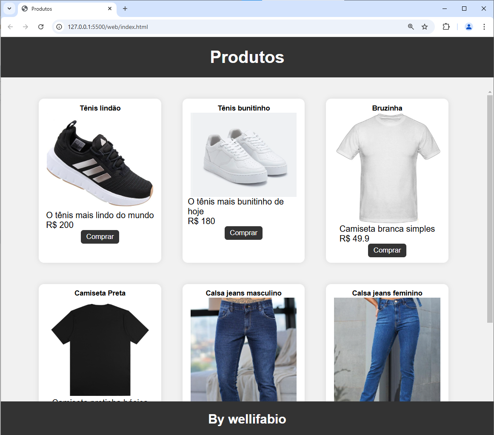

# Listar Cards
Exemplo de aplicativo web full stack, com dados a partir de uma API prisma, e um script para listar todos os cards cadastrados.

## Requisitos
- [Node.js](https://nodejs.org/en/)
- [VsCode](https://code.visualstudio.com/)
- [XAMPP](https://www.apachefriends.org/pt_br/index.html)

## Instalação
1. Clone este repositório
2. Abra com o VsCode e abra o terminal **bash** ou **cmd**
3. acesse a pasta **./api** e execute o comando `npm install`
```bash
cd api
npm install
```
4. crie um arquivo `.env` na pasta **./api** e adicione a seguinte linha:
```env
DATABASE_URL="mysql://root@localhost:3306/produtos?schema=public&timezone=UTC"
```
5. Abra o XAMPP e inicie o servidor **Apache** e **MySQL**
6. No terminal do vs code instale o banco de dados e os dados de exemplo seed via prisma
```bash
npx prisma migrate dev --name init
```
7. Inicie o servidor da API
```bash
node server.js
#ou
npx nodemon
```
8. Abra a pasta **./web** e execute o arquivo `index.html` no navegador ou via live server do VsCode.
